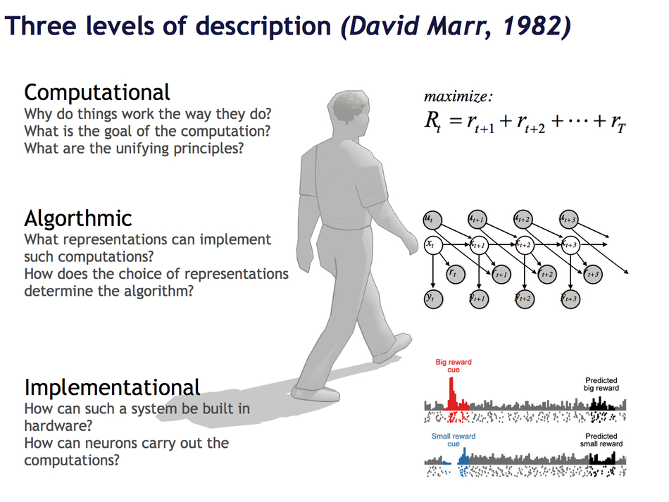
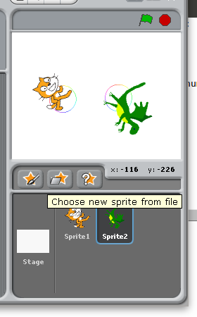
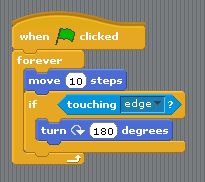
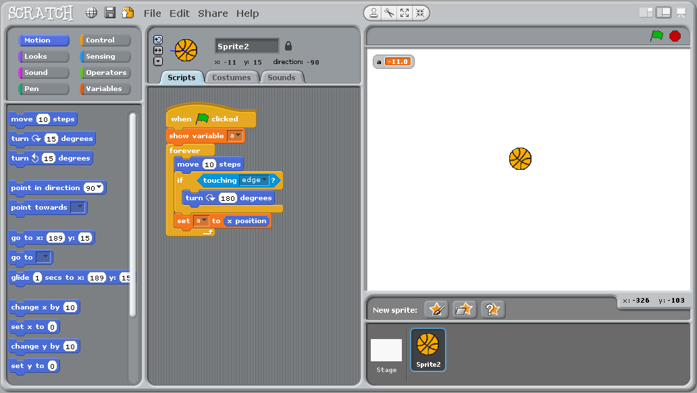
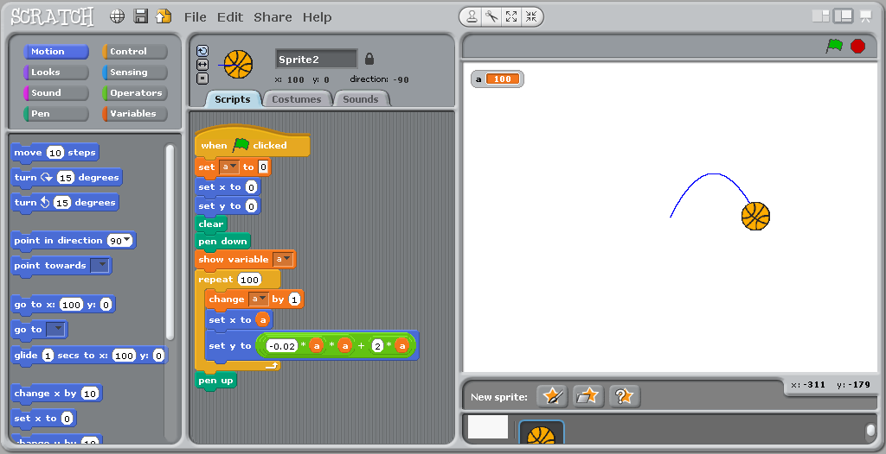
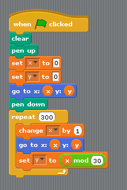
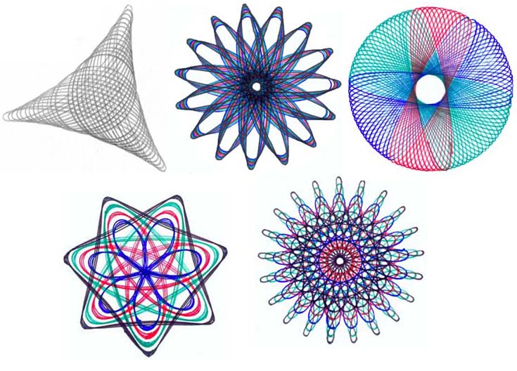

% Crash course in programming, with Scratch
% christophe@pallier.org
%

# Programming = turning an algorithm into code

**Problem => Algorithm => Coding**

Strictly speaking, to program is to explain to a computer how to carry out an algorithm (the second arrow), not to find an algorithm for a problem (first arrow).

Although "AIP" means "Atelier d'introduction à la Programmation/Python" we will try to train you also on the first stage.

. . .

Examples of Problems:

    - Cooking boiled eggs
    - Integer division of two numbers
    - Missile Pursuit (or animal chasing a prey)
    - Play a game like chess
    - Recover 3D information from stereoscopic images

Note: suggested readings David Marr (1982, _Vision_)'s three levels of description in cognitive science.

# Why Python

Because computers are stupid (that is, they lack a _theory of mind_ and cannot guess your desires and intentions), you must provide very detailed and exhaustive instructions. The choice of the programming language is relevant here.

There exist many programming languages (and also different computer architectures, e.g. parallel vs. serial)

In 2000, we decided to use Python for the Atelier d'Experimentation, because it is:

- clean (the code can be relatively close to the algorithm)
- general-purpose (vs. Matlab)
- multiplatform
- free software

. . .

Learning to program takes time because it requires to master not only the semantic but also the syntax (=grammar) of the language.

. . .

Like learning to play an instrument, programming is a skill that you can only acquire by trying (and making _lots of_ mistakes and correcting them!!!).

Yes you can! Let's go! 

# Starting from/with Scratch

We not use Python for this first lecture!

**Scratch** (<http://scratch.mit.edu>) was designed by the MIT media lab to teach kids how to program.

Its main interest: programs are created using a graphical interface, preventing _syntactic errors_ (thus, you can learn the language without learning the grammar!)

One can either work online at <https://scratch.mit.edu/projects/editor/?tip_bar=home> or offline by downloading Scratch at

- <https://scratch.mit.edu/scratch_1.4/> (version 1)
- <https://scratch.mit.edu/scratch2download/> (version 2)

You may want to run the tutorial "Getting Started with Scratch" on the website.

# First steps

### Program 001

In the 'motion' group, take the instruction 'turn 15 degrees' and drag it onto the 'Scripts' panel. 

Double-Click repeatedly on the block 'turn 15 degrees', you should see the cat ('sprite 1') rotate.

In Scratch, when one double-clicks an instruction in the 'Scripts' panel, the computer **executes** it.

### Program 002

Drag the instruction 'move 10 steps' from the motion group, and add it to the bottom of the instruction 'turn 15 degrees'. Change the value '10' into '50'. 

You have just created a **block** of instructions, that is, your first **program** or **script**, Bravo!

* Double-Click on the block and see the sprite moving.
* Note that inside a block, instructions are exectuted *sequentially*, one after the other. **Can you prove it**?
* Experiment with changing the **argument** of the instruction 'move' (Tip: to clear the drawing area, move the instruction 'pen/clear' to the script window and execute it)  

### Program 003

Click on the 'pen' group, and add 'pen down' at the top of the block.

Run it.

### Program 004

Construct the following scripts and play with them until you are sure to understand the behavior of the computer..

# Concepts learned so far

* Instruction
* Argument of an instruction (change '10' in 'move 10 steps')
* Block of instructions and sequential execution

# Loops 

# repeat ('for' loop)

Computers are good at doing tasks repeatedly (as they do not get tired).

Click on the "Control" group, and try to construct the following script:

* Clicking on the 'green' flag will execute the block of instructions
* The  'Repeat' instruction executes the inner block of instruction a number of times specified as an argument. This is called a **loop**
* Adjust the parameter of the Repeat instruction so that the sprite draws a full circle when you click once on the green flag.
* Replace the repeat instruction by 'forever'.

### Repeat until 

Modify the script as follows:

Tip: the condition 'key space pressed?' is in the 'Sensing' group.

This illustrates a **repeat...until loop**: the inner block is executed until the **condition** is satisfied.

# Two sprites

Add a new sprite, and duplicate the script from sprite1. Click on the green flag. You should see the two sprites running in circles.

Remark that the scripts associated to the two sprites run in *parallel* (rather than sequentially). 

# Conditional execution or branching

Create a new scratch project, and change the costume of the sprite into a ball.

Then write and execute the following script.

  
You should see the ball bounce on the edges. 

# First series of exercices

1. With Scratch, use the instructions "pen down" and "move" and "turn" to (a) make the cat draw a square (with sides measuring 100 steps) (b) draw an hexagon (c) draw a circle 

2. Using the Control/Forever, make the cat turn continuously along a circle.

3. Bouncing ball
* Delete the cat. Using new sprite/open, add a ball.
* Make the ball move automatically horizontally from left to right and bounce when it touches an edge (tip: use Control/forever)
* Make the ball follow the mouse.
* Add a second ball that follows the first. 

4. Create a script that asks for your name and then displays "Hello <your_name>!". Tip: use the instructions 'sensing/ask', 'looks/say' and 'operator/join' and the variable 'sensing/answer'. 

# Variables

Using the group 'variable', we are going to create a **variable** 'a' and make it display continuously the x-coordinate of the ball.

The concept of **variable** is very important. You can think of it as a name for a object that can change (here the object is a number).

Now study the following script:

The loop is executed 100 times. Each time, the value of the variable `a` is incremented by 1, and is used to compute new `x` and `y` coordinates where to sprite is instructed to moved to.

# Second series of exercices

1. 'Multiply by adding'. Write a program that reads in two integer numbers and displays their sum.

1. "Guess a number". Make Scratch pick up a random number in the interval [1,100], and  loop asking you for a guess and reply either 'too low', 'too high', or 'you win!' depending on your answer.  

2. Create a script that initializes a variable 'a' to 0, then repeatly (10000 times) picks up two random numbers on the interval [0,100], plots a dot at these coordinates, and add 1 to the variable 'a'  if the dot is within the circle of radius 100 centered on (0,0). Can you tell what 'a' is an estimate of? 

3. Pong (optional). Program a racket that you can move horizontally, to the left or to the right, with two keys on the keyboard and a ball that bounces on edge or on the racket.

4. "Spirograph".

Read <http://www.mathplayground.com/Spiromath.html> and write a scratch program that draws these figures (note: search the web for the math formulas that allow to compute x, and y; they require a bit of trigonometry, i.e., use the 'sin' and 'cos' functions).

