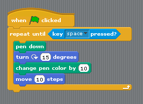

% Crash course in programming, with Scratch
% christophe@pallier.org
%

This introduction to programming relies on [Scratch](http://scratch.mit.edu), a programming language for kids.

You can either work online at <https://scratch.mit.edu/projects/editor/?tip_bar=home> or offline by downloading Scratch at <https://scratch.mit.edu/scratch_1.4/>

You may want to run the tutorial "Getting Started with Scratch" on the website.

First steps
-----------

### Program 001

In the 'motion' group, take the instruction 'turn 15 degrees' and drag it onto the 'Scripts' panel. 

Double-Click repeatedly on the block 'turn 15 degrees', you should see the cat ('sprite 1') rotate.

In Scratch, when one double-clicks an instruction in the 'Scripts' panel, the computer **executes** it.

### Program 002

Drag the instruction 'move 10 steps' from the motion group, and add it to the bottom of the instruction 'turn 15 degrees'. Change the value '10' into '50'. 

You have just created a **block** of instructions, that is, your first **program** or **script**, Bravo!

* Double-Click on the block and see the sprite moving.
* Note that inside a block, instructions are exectuted *sequentially*, one after the other. **Can you prove it**?
* Experiment with changing the **argument** of the instruction 'move' (Tip: to clear the drawing area, move the instruction 'pen/clear' to the script window and execute it)  

### Program 003

Click on the 'pen' group, and add 'pen down' at the top of the block.

Run it.

### Program 004

Construct the following scripts and play with them until you are sure to understand the behavior of the computer..

### Concepts learned so far

* Instruction
* Argument of an instruction
* Block of instructions and sequential execution

Loops 
-----

Computers are good at doing tasks repeatedly (as they do not get tired).

Click on the "Control" group, and try to construct the following script:

* Clicking on the 'green' flag will execute the block of instructions
* The  'Repeat' instruction, execute the inner block of instruction a number of times specified as an argument. This is called a **loop**
* Adjust the parameter of the Repeat instruction so that the sprite draw a full circle when you click once on the green flag.
* Replace the repeat instruction by 'forever'.

### Repeat a block until 

Modify the script as follows:

Tip: the condition 'key space pressed?' is in the 'Sensing' group.

This illustrates a **repeat..until loop**: the inner block is executed until the **condition** is satisfied.

### Two sprites

Add a new sprite, and duplicate the script from sprite1. Click on the green flag. You should see the two sprites running in circles.

# Prove that the scripts associated to the two sprites run in *parallel* (rather than sequentially).

Conditional execution or branching
----------------------------------

Create a new scratch project, and change the costume of the sprite into a ball.

Then write and execute the following script.

  
You should see the ball bounce on the edges. 

Variables
---------

Using the group 'variable', we are going to create a **variable** 'a' and make it display continuously the x-coordinate of the ball.

The concept of **variable** is very important. You can think of it as a name for a object that can change (here the object is a number).

Now study the following script:

The loop is executed 100 times. Each time, the value of the variable `a` is incremented by 1, and is used to compute new `x` and `y` coordinates where to sprite is instructed to moved to.

Exercices
=========

Exercice 1. With Scratch, use the instructions "pen down" and "move" and "turn",(a) make the cat draw a square (with sides measuring 100 steps) (b) draw an hexagon (c) draw a circle (d) Draw a house (just a rectangle with a triangle on top of it)

Exercice 2: Using the Control/Forever, make the cat turn continuously along a circle.

Exercice 3: Using the Control/If, make the cat react when you press any of the arrow buttons, by advancing in the corresponding direction (e.g., if you press the up arrow, the cat should move up by 10 steps)

Exercice 4: Bouncing ball
* Delete the cat. Using new sprite/open, add a ball.
* Make the ball move automatically horizontally from left to right and bounce when it touches an edge (tip: use Control/forever)
* Make the ball follow the mouse.
* Add a second ball that follows the first. 

Exercice 4: "Spirograph". Download the project "Kitty Graphics" on Scratch web site and study the code. Can you understand it? It uses several concepts that we have not yet seen (e.g. variables)

 

