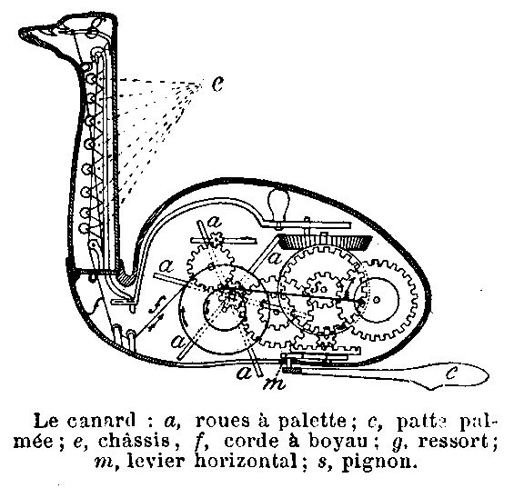
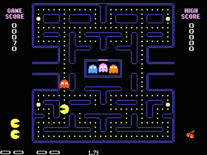
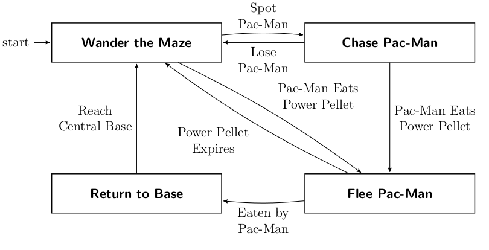
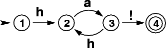
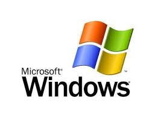
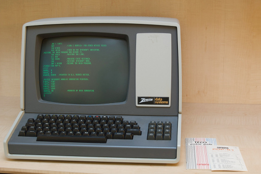
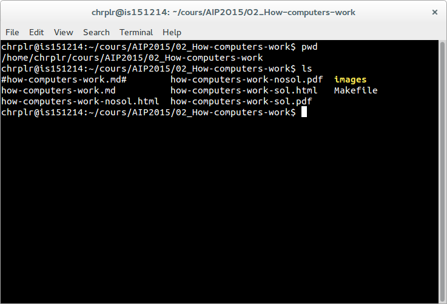

% How computers work
% christophe@pallier.org
% Sep. 2015

# Automaton

Definitions from the Merriam-Webster dictionary:

* A mechanism that is relatively self-operating
* A machine or control mechanism designed to follow automatically a predetermined sequence of operations

. . .

Examples:

* drinks vending machine

* clocks

*  "Canard" et "Joueur de flûte" by Jacques de Vaucanson (1733)

"L'Encyclopédie fit de Vaucanson un demi-dieu et le célébra pour ses automates extraordinaires : pour la première fois des êtres artificiels étaient capables, par le génie du cerveau humain, de jouer parfaitement d'un instrument de musique ou de se comporter comme de véritables êtres vivants." 

# Formal description of automata

At a abstract level, an automaton can be formally described by:
- a set of internal **states**
- a **transition** table that describes the **events** that lead to changes from state to state

### Change counter in a vending machine

 

---------------

### Pacman's ghost

---------------------- ---------------------------------------------------------------------
 
---------------------- ---------------------------------------------------------------------

### Birdsong

Finite state automaton description of Bengalese Finch songs

 

From Berwick et al., 2011 _Trends in Cognitive Sciences_ 15, 3: 113–21

(see also Descartes. *Les animaux Machines*  [Lettre au Marquis de Newcastle](http://www.ac-grenoble.fr/PhiloSophie/logphil/oeuvres/descarte/newcastl.htm)

--------------

## Pattern recognition

(a very useful tool in Computer Science are  _regular expressions_, a way to describe patterns and find them in data)

## Capturing the Grammar of English language

See [David Temperley's Visual representation of the English language](http://theory.esm.rochester.edu/temperley/visual-english.pdf) for more.

# Remarks

*  Events associated to transition can be input and/or output

*  Automata can react to external events in a context-sensitive manner because the current states depends on the history of states. 

Computer science terminology: _finite state machines_ (FSM), or _finite state automaton__ (FSA)

Exercice: draw the transition diagram for a simple coffee machine with three states (off/on/brewing) and two buttons (switch on/off and brew)

# Computers

Computer =  automaton with an additional memory store.

### Turing Machines

Alan Turing (1936).

Intended as a mathematical model of computation, it is a finite state machine augmented with a tape and a mechanism to read/write on it.

. . .

In the 1930s, there were several independent attempts to formalize the notion of computability, and it was discovers that all of them were equivalent in power!

**Church–Turing thesis** : a function on the natural numbers is computable in an informal sense (i.e., computable by a human being using a pencil-and-paper method, ignoring resource limitations) if and only if it is computable by a Turing machine. 

For more information about Turing machines, see <https://en.wikipedia.org/wiki/Turing_machine>

# Register machines

A register machine is another computing model that is closer to actual computers. 

 _The seven secrets of computer power revealed_ (Chapter 24 from
Daniel Dennett (1023) _Intuition Pumps and other tools for thinking_)

(an older version is available at <http://sites.tufts.edu/rodrego/files/2011/03/Secrets-of-Computer-Power-Revealed-2008.pdf>)

(Online Demo at  [http://proto.atech.tufts.edu/RodRego/](http://proto.atech.tufts.edu/RodRego/)

Registers = memory locations, each with a unique _address_ (1, 2, 3, ...), and each able to have , as _contents_, a singel integer (0, 1, 2, ...)

Processing unit that can execute instructions in a stepwise, one-at-a-time fashion. The processor knows just 3 instructions:

- _End_
- _Increment register_  with 2 arguments: a register #, an step number
- _Decrement register and Branch_ with 3 arguments, a register number and two step numbers.

### Program 1 (ADD[0,1])

    1 DEB 0 2 3
    2 INC 1 1
    3 END

Exercice; Simlulate this program on a machine wheret  Reg0 contains 4 and Reg1 contains 7, and explain what it is doing.

. . .

This program adds the content of register 0 to register 1 (destroying the content of 0)

### Program 2 (MOVE[4,5])

Exercice: write a program that moves the content of reg4 intro reg5

. . .

	1 DEB 5 1 2
	2 DEB 4 3 4
	3 INC 5 2
	4 END

. . .

### Program 3 (COPY[1,3])

The following program copies the content of reg1 into reg3, leaving reg1 unchanged.

	1 DEB 3 1 2
	2 DEB 4 2 3
	3 DEB 1 4 6
	4 INC 3 5
	5 INC 4 3
	6 DEB 4 7 8
	7 INC 1 6
	8 END

### Program 4 (NON DESTRUCTIVE AD[1,2,3])

	 1 DEB 3 1 2
	 2 DEB 4 2 3
	 3 DEB 1 4 6
	 4 INC 3 5
	 5 INC 4 3
	 6 DEB 4 7 8
	 7 INC 1 6
	 8 DEB 2 9 11
	 9 INC 3 10
	10 INC 4 11
	11 DEB 4 12 13
	12 INC 2 11
	13 END

. . .

Note that _conditional branching_ is the key instruction that gives the power to the machine. Depending on the content of memory, the machine can do either (a) or (b). 

# The 7 secrets of computers revealed

1. Competence without comprehension. A machine can do perfect arithmetic without having to comprehend what it is doing.

2. What a number in a register stands for depends on the program

3. The register machine can be designed to discriminate any pattern that can be encoded with numbers (e.g. images, text, sensory inputs,...)

4. Programs can be encoded by numbers.

5. All programs can be given a unique number which can be treated as a list of instructions by a Universal Machine.

6. all improvements in computers over Turing machine (or Register machine), are simply ways of making them faster

7. There is no secret #7

# Programs

* The first computers were not programmable. They were hardwired! 

* Programmable computer: 
    - a program is a set of instructions stored in memory.
    - Loaded and executed by a processor. 
    - Such programs are written in machine langage (the language of the processor)

Programs in higher-level languages (rather than Machine language) can be either
* **compiled**, or
* **interpreted**

In both cases, you write the program as textual files.

A **compiler** translates the program into an executable file in machine language. The exectutable file is standalone.

An **interpreter** reads the file and execute the commands one by one. It is slower, but easier to interact with. Disatvange: you need the interpreter at all time.

# Operating systems

In the first computers, there was only **one** program running. Yo would load the program into memory, then run it until the end. Programs were ran in BATCH mode, in a sequence.

Then, it was realized that computers could 'time-share' between programs, allowing several users (or programs) to share the computer.

This requires an operating systems (O.S.). The O.S. is the first program that loads into the computer during the boot. When running:

* it controls the hardware (screen/printer/disk/keybord/mouse,...) (drivers) 

* it manages all the other programs (processes/tasks/applications).
    * sharing memory
	* allocating processors and cores
	* allocating time 
  
    Check out _Task Manager_ (Windows)/_System Monitor_ (Linux)/ _Activity Monitor_ (Mac)

------------------------------- --------------------------- --------------------------
		
-------------------------------	---------------------------	--------------------------

Different OS offer different "views" of the computer (e.g. 1 button mouse in Mac, 2 in Windows, 3 in Linux), so often programs are designed to work on one OS (bad!). Prefer multiplatform software (like Python).

Several OS can be installed in a given machine: 
- choice at boot (multiboot)
- an OS can run inside a **virtual machine**, that is a program running in another (or the same) OS, and emulating a full computer.

* * * * *

# What is a Terminal?

---------------------------  -----------------------
  
---------------------------  -----------------------

**Terminal** (or **console**):  originaly, a device comprising a keyboard and screen, allowing a human to *interact* with a computer. 

Notes:

- Early computers had no keyboard, no screen. The input was done through punched cards and output would be printed out).

- In the mainframe era, many terminals were connected to a single, powerful, computer. Everybody was sharing the same computer.

- With the advent of _Personal Computers_, the terminal and the computer became a single apparatus.

However, terminals can be *virtual*. A terminal is a program that let you run text programs. You interact by typing and displaying text. No graphical interface/no mouse.

When you open a terminal, a program called a **shell** is started that displays a prompt, and waits for you to enter commands with the keyboard.

## How to open a Terminal

- Ubuntu-Linux: Ctrl-Alt-T (see <https://help.ubuntu.com/community/UsingTheTerminal>)

- MacOSX: Open Finder/Applications/Utilities/Terminal (see <http://www.wikihow.com/Get-to-the-Command-Line-on-a-Mac>)

- Windows: Win+X+Command-Prompt (see <http://pcsupport.about.com/od/commandlinereference/f/open-command-prompt.htm>)

## The shell

Inside the terminal, you are interacting with a program called a **Shell**.

Various *Shells* exists: under Windows: cmd/powershell; under, Mac/linux: bash/tsch... they speak slighlty different languages.

The shell displays a prompt and waits for you to type commands that it will execute. For example, if you type ipython, it will start the ipython program.

One issue is that you have to know the available commands and the language.
By contrast with a Graphical User Interface shell with
Windows/Icons/Menus, **Textual shells** have a very poor ergonomy. Yet, there are more powerful. They provides variables, loops,... to facilitate automation of tasks.

For example, to create 20 directories in a single bash command under linux:

    for f in 01 02 03 04 05 06 07 08 09 10; do mkdir -p subject_$f/data subject_$f/results; done

To learn more, see Wikipedia's article on  *Shell_(Computing)*: <http://en.wikipedia.org/wiki/Shell_%28computing%29>

Good news: you will not need to learn a *shell* language, only a few commands (pwd/cd/ls/dir) to allow you to navigate the filesystem and run a program.

* * * * *

# Disks, Directories and files

Most computers (not all) have two kinds of memories: 
- volatile, fast, memory, which is cleared when the computer is switched off (processor's caches, RAM)
- 'permanent', slow, memory, which is not erased when the computer is switched off (DISKS, Flashdrives (=solid-state drives))

The unit of storage is the **file**. 

Files are nothing but blobs of bits stored "sequentially" on disks. 

A first file could be stored between location 234 and 256, a second file could be stored at location 456.

# filenames, directory structure

To access a file,  one would need to know its location on the disk.
To simplify human users' life, the OS provide a system of "pointers", that is **filenames** , organised in directories. 

To help users further, the directories are organised in a hierarchical structure: a directory can contain filenames and other (sub)directories. The top-level directory is called the **root**. 

To locate a file, you must know:
- its location in the directory structure
- its basename

Remark: a given file can have several names in the same or various directories (remember: a filename is nothing but a link between a human readable charachter string to a location on the disk)

## Working directory. Absolute pathnames vs. relative pathnames (..)

It would be tedious to always have to specify the full path of a files (that is, the list of all subdirs from the root)

Here comes the notion of **working directory**: A running program has a working directory and filenames can specified **relative** to this directory.

Suppose you want to access the file pointed to by `/users/pallier/documents/thesis.pdf`. If the current working directory is `/users/pallier`, you can just use `documents/thesis.pdf` (notice the absence of '/' at the beginning).

To determine the current working directory, list its content, and change it:

- under bash

	 pwd
	 ls
	 cd Documents

- under Windows/DOS

	 echo %cd%
	 dir
	 cd Documents
	

- under python (or ipython):

	import os
	os.getcwd()
	os.listdir('.')
	os.chdir('documents')
	os.getcwd()
	
	
# PATH

A command can simply be a program's name. Typing it and pressing Enter will start the program.

The shell knows where to look for programs thanks to a special environment variable called the **PATH**

Under bash

	echo $PATH
	which python

Under Windows/DOS:

	echo %PATH%
	

The PATH variable lists all the directories that contains programs.

It is possible to add new directories to the PATH variable, to access new programs.

bash

	export PATH=newdirectory:$PATH

DOS

	PATH=newdirectory;%PATH%

# What is a library (or module/package)?

A set of new functions that extend a language (.DLL (Windows);.a or .so (Linux); framework bundles (MacOs))

Dynamic libraries can be used simultaneously by several processes. 

Eg. the function @@sqrt@@ can be defined once, and called by several programs, saving memory.  

In Python, use @@import library

	import math
	math.srqt(2)
	
	

