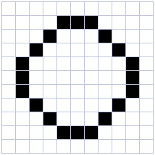

% How numbers, images and texts are represented in the computer
% Christophe@pallier.org
% Sept. 2015


# Warm up

(@) What does the following code do?

```python
for i in (1, 2, 3, 4, 5):
	print(""All work and no play makes Jack a dull boy")
```

. . .

Modify it to print the line 100 times (You want to do a loop, check python's documentation)

. . .

One possible solution, using a "while loop":

```python
n = 1
while n <= 100:
	print(""All work and no play makes Jack a dull boy")
	n = n + 1
```

. . .

Another, using a "for loop" and the function `range`:

```python
for _ in range(100):
	print(""All work and no play makes Jack a dull boy")
```

. . .

Modify the program to randomly select a name in the set {John, Jack, Paul, Tim} at each line.

(hint: import the module "random" and use the function "random.choice")

. . .

```python
import random

NAMES = ('John', 'Jack', 'Paul', 'Tim')

for _ in range(100):
	name = random.choice(NAMES)
	print("All work and no play makes " + name +  " a dull boy")
```


-------------

(@) What does the following function compute?

```python
def mysterious(n):
	""" ???? """ 
	sum = 0
	for i in range(1, n+1):
		sum = sum + i
	return sum
```

. . .

It computes the sum of all integers between 1 and n.


Remark: Freidriech Gauss would probably have written:

```python
def sum2(n):
	""" returns the sum of integers between 1 and n """
	return n * (n + 1) / 2
```


# Representation of integers


*There are 10 kinds of people: those who count in binary and the others.*


Computers represent everything as series of 0 and 1, also known as *bits* (for "binary digits"). 


Just like a number can be written in base 10, it can be written in base 2:

E.g. 
	  
	12 : 10  + 2  = 8 + 4 = 2**3 + 2**1 : 1010
    33 : 30  + 3  = 32 + 1 = 2**5 + 1 : 100001

	1 :   1
	2 :  10
	3 :  11
	4 : 100
	5 : 101
	6 : 110
	7 : 111
	...


To learn more about how integer numbers are reprsented in binary format, you can check out <http://csunplugged.org/binary-numbers>

(@) Convert (manually) into decimal the following binary numbers:
- 101
- 1000
- 1011
- 11111111

#ifdef ANSWERS
*Answer:* 5, 8, 11, 255
#endif

(@) Write a function that, given the binary representation of a number as a string of '0' and '1', returns its value as a integer. 

#ifdef ANSWERS
```python
def todec(s):
	""" convert a string of 0 and 1 representing a binary number into an integer """
	n = 0
	for i in s:
		n = n * 2 + int(i)
	return n

for i in ['101', '1000', '1011', '11111111']:
	print(todec(i))
```	
#endif


(@) Now we will go in the other direction: Our aim is to write a program that, given a number (in decimal), computes its binary representation.

If you have an idea how to program it, please proceed. If not, we propose that you follow the following steps: 

(@) Study the program below.  Execute it with various values of the variable *num*. Do you understand the last line? Do you see a limitation of this program? 

```python
num = 143 
d3 = int(num/1000) % 10 # thousands
d2 = int(num/100)  % 10 # hundreds
d1 = int(num/10)   % 10 # dec
d0 =  num % 10 
print(str(d3) + str(d2) + str(d1) + str(d0))
```

(@) Adapt the above program to print the binary representation of num

#ifdef ANSWERS
```python	
num = 17
b0 = num % 2
b1 = int(num/2) % 2
b2 = int(num/4) % 2
b3 = int(num/8) % 2
b4 = int(num/16)  % 2
b5 = int(num/32)  % 2
b6 = int(num/64)  % 2 
b7 = int(num/128) % 2 
b8 = int(num/256) % 2
print(str(b8) + str(b7) +  str(b6) + str(b5) + str(b4) + str(b3) + str(b2) + str(b1) + str(b0)) 
```
#endif

(@) Modify the above program to print the binary representations of every number between 0 and 255.

#ifdef ANSWERS
```python	
def tobin(num):
	b8 = int(num/256) % 2
	b7 = int(num/128) % 2 
	b6 = int(num/64)  % 2 
	b5 = int(num/32)  % 2
	b4 = int(num/16)  % 2
	b3 = int(num/8) % 2
	b2 = int(num/4) % 2
	b1 = int(num/2) % 2
	b0 = num % 2
    return (str(b8) + str(b7) +  str(b6) + str(b5) + str(b4) + str(b3) + str(b2) + str(b1) + str(b0))
	
for n in range(256):
	print(n, tobin(n))

```
#endif

(@) (Advanced) Write an improved version that uses a loop and does not have a limitation in size.

#ifdef ANSWERS
```python
def binary(n):
	if n==0:
		return "0"
	s = ""
	while n > 0:
		b = str(n % 2)
		s = b + s
		n = n / 2
	return s
```
#endif

(@) Study the following code. Do you understand why it works?

```
def binary(num):
	if num == 0:
		return "0"
	if num == 1:
		return "1"
	return(binary(int(num /2)) + binary(num % 2))
	
print(binary(1234))
```

#ifdef ANSWERS

*Answer:*
It is a recursive function which calls itself. See <http://en.wikipedia.org/wiki/Recursion_%28computer_science%29>
#endif

Remark: measures of memory size

* 1 byte = 8 bits
* 1 Kilobyte (KB) = 1024 bytes
* 1 Megabyte (MB) = 1024 kbytes = 1048576 bytes
* 1 Gigabytes (GB) = 1024 Mbytes 
* Terabyte, Petabyte, Exabyte...


Exercice (advanced): Write a function that return the hexadecimal representation (base 16) of a number.


To go further: 

* If you want to know how negative integer numbers are represented, see <http://en.wikipedia.org/wiki/Two%27s_complement>

* To understand how real numbers are encoded, read  [What Every Programmer Should Know About Floating-Point Arithmetic](http://floating-point-gui.de/)
and <https://docs.python.org/2/tutorial/floatingpoint.html#tut-fp-issues>


# Representation of text

A text file is nothing but a sequences of characters (a word document is not a text file).

For a long time, characters were encoded using ASCII code. 


(@) lookup the ASCII representation of  your first name in the table and use the chr function of Python to print it.

#ifdef ANSWERS
For example, if you name is 'ZOE', you would type:

	print(chr(90)+chr(79)+chr(69))

#endif 

Remark: **ASCII** codes use one byte per characters. This is fine for English, but cannot cover all the caracters of all alphabets. It cannot even encode french accented letters.

**Unicode** was invented that associate a unique 2 bytes number to each character of any human script. It is possible to write text files using these number, but more economic to encode the most common letters with one byte, and keep the compatibility with ASCII (UTF-8).


### How to read a text file in Python

Download [Alice in Wonderland](http://www.pallier.org/cours/AIP2013/alice.txt)

```python
f = file('alice.txt')
o = f.read()
print(o)
lines = o.split("\\n")
print(lines)
```

(@) Write a program that counts the number of lines, and number of words in alice.txt (we suppose that words are separated by spaces).

#ifdef ANSWERS
```python
f = file('alice.txt')
o = f.read()
print(o)
lines = o.split("\n")

nlines = len(lines)

nw = 0
for l in lines:
	nw += len(l.split(" "))
	
print(nlines)
print(nw)
```
#endif

(@) Write a program that detects if a text file contains the word 'NSA'

#ifdef ANSWERS
```python
def spot_nsa(filename):
	f = file(filename)
	o = f.read()
	lines = o.split("\n")
	found = False
	for l in lines:
		if "NSA" in l.split(" "):
			found = True
			break
	return found
```
#endif

- - -

Representation of images
------------------------

Images can be stored either:

* as bitmaps, that is a two dimensional arrays of dots (formats: bmp, png, gif, jpeg...)
* as vectorized formats, the image contain instruction for drawing objects (eps, pdf, svg, ...).

Here we are just going to manipulate bitmaps.

### Black and white bitmaps 

Each dot (pixel) is either '0' (black) or '1' (white).



(@) What is the size in kilobytes of a 1024x768 pixels images ?

#ifdef ANSWERS

*Answer:* 1024*768/8/1024=96 KB

#endif

(@) Execute the follwoing code (it requires the modules numpy and matplotlib).

```python
import numpy as np
import matplotlib.pyplot as plt

a = np.array([[0, 0, 0, 0, 0, 0, 0],
              [0, 0, 1, 1, 1, 0, 0],
			  [0, 0, 1, 1, 1, 0, 0],
			  [0, 0, 1, 1, 1, 0, 0],
			  [0, 0, 1, 1, 1, 0, 0],
			  [0, 0, 1, 1, 1, 0, 0],
			  [0, 0, 0, 0, 0, 0, 0]])
plt.imshow(a, cmap=plt.cm.gray, interpolation='nearest')
plt.show()
```

Numpy's arrays are a new type of object. There are similar to lists, but optimised for mathematical computations. Notably, they can be multidimensional (i.e. you can use a[i,j] notation). You can learn more about arrays in the documents <http://www.pallier.org/cours/AIP2013/python4science.pdf> and <http://wiki.scipy.org/Tentative_NumPy_Tutorial>.


(@) Exercice: 

1. Create a cross.
2. create a 200x200 bitmap:
    1. add a diagonal 
    2. make two crosses imitating the British Flag


#ifdef ANSWERS

```python
a = np.zeros((200,200))
for i in range(200): 
	a[i, i] = 1
plt.imshow(a, cmap=plt.cm.gray, interpolation='nearest')
plt.show()
a[0:200:2,] = 1
plt.imshow(a, cmap=plt.cm.gray, interpolation='nearest')
plt.show()
```
#endif

# Grey level pictures

Each dot is now associated to an integer value, e.g. ranging from 0 to 255 for 8-bits codes, coding for a grey level (smaller=darker). Each dot needs one byte.

How large is the file for a 1024x768 image pixels with 256 grey levels?


The following code displays an image:

```python
import scipy.misc 
l = scipy.misc.lena()
plt.imshow(l,  cmap=plt.cm.gray)
plt.show()
```

This code runs a low pass (averaging) filter on it:

```python
import scipy.ndimage
bl = scipy.ndimage.gaussian_filter(l, 3)
plt.imshow(bl,  cmap=plt.cm.gray)
plt.show()
```

Edge detector. It is easy to implement an edge detector with a neural network. See <https://courses.cit.cornell.edu/bionb2220/UnderstandingLateralInhibition.html>. 

Using the ndimage.convolve function, apply the following filters to the image and diplay the results.

```python
kernel1 = np.array([[-1, -1, -1],
                   [-1,  8, -1],
                   [-1, -1, -1]])


kernel2 = np.array([[-1, -1, -1, -1, -1],
                   [-1,  1,  2,  1, -1],
                   [-1,  2,  4,  2, -1],
                   [-1,  1,  2,  1, -1],
                   [-1, -1, -1, -1, -1]])
```

More manipulations are available at <http://scipy-lectures.github.io/advanced/image_processing/>. 


### Colored bitmaps

Each dot is now associated to three bytes, representing the Red, Gree and Blue intensities (see <http://www.colorpicker.com/>).

How large is the file for a 1024x768 RGB image?

Exercice: What are the RGB triplets for BLACK, WHITE, RED, YELLOW?


