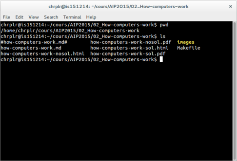

% How to open a terminal
% Time-stamp: <2015-09-11 11:38 christophe@pallier.org>
%

* **MacOSX** Open Finder/Applications/Utilities/Terminal (see <http://www.wikihow.com/Get-to-the-Command-Line-on-a-Mac>)

* **Windows** Win+X and select 'Command-Prompt' (see <http://pcsupport.about.com/od/commandlinereference/f/open-command-prompt.htm>)

* **Ubuntu-Linux** Ctrl-Alt-T (see <https://help.ubuntu.com/community/UsingTheTerminal>)

Here is how a terminal looks like in Linux:

In the terminal, you are interacting with a program called a *shell*.

This program waits for you to type commands with the keyboard.

In this lecture, you will just need to know very few commands:

- **Linux/MacOSX** pwd, cd, python, ipython

- **Windows cmd** echo %cd%, cd, python, ipython

To learn more, see the lectures 'how computers work' and 'how to use a computer interactively'.

